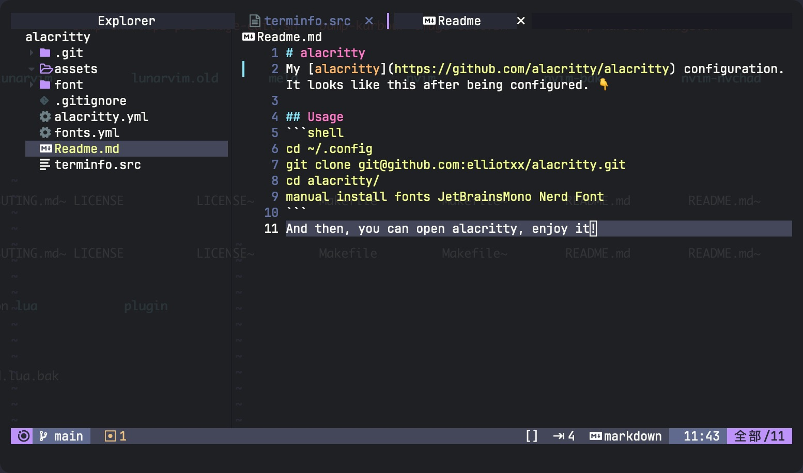

# alacritty
My [alacritty](https://github.com/alacritty/alacritty) configuration. It looks like this after being configured. 👇



## Usage
```shell
cd ~/.config
git clone git@github.com:elliotxx/alacritty.git
cd alacritty/
manual install fonts JetBrainsMono Nerd Font
```
And then, you can open alacritty, enjoy it!
